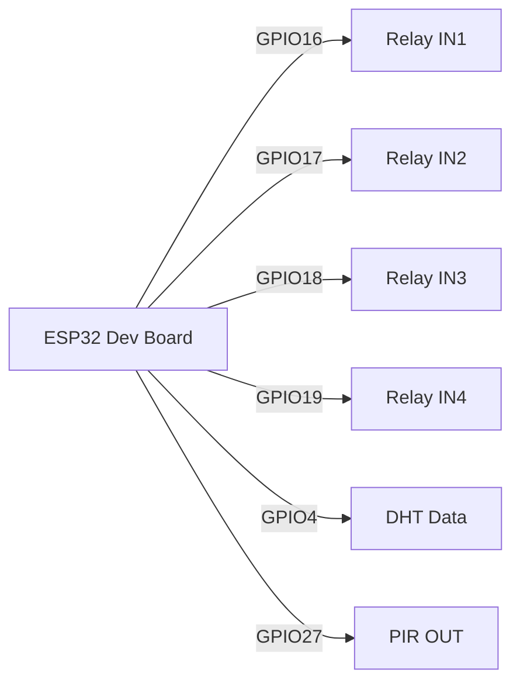

# Smart Home System (ESP32 + Web Dashboard)

A modular and scalable ESP32-based smart home controller with asynchronous networking, persistent state, and a built-in web dashboard.

## Overview

This project provides a production-style firmware structure for edge home automation:
- 4 relay channels for lights/appliances
- Temperature sensing (DHT11/DHT22)
- Motion detection (PIR)
- REST API for integration
- Real-time web dashboard served from ESP32 (LittleFS)
- Non-volatile relay state persistence via Preferences (NVS)
- Optional MQTT integration behind a compile-time flag

## Architecture

### High-level flow

```text
Web Dashboard <-> Async REST/SSE API <-> Domain Services <-> GPIO + Sensors + NVS
                                            |
                                            +-> Optional MQTT Bridge
```

### Component responsibilities

- `firmware/src/main.cpp`
Initializes all modules, wires callbacks, and runs the event loop.

- `firmware/src/net/ApiServer.*`
Owns HTTP routes, static file hosting, and SSE (`/events`) for live updates.

- `firmware/src/actuators/RelayController.*`
Encapsulates relay state transitions and GPIO write logic.

- `firmware/src/sensors/SensorManager.*`
Polls temperature and motion sensors on schedule and emits state changes.

- `firmware/src/storage/StateStore.*`
Persists relay state in NVS and restores it at boot.

- `firmware/src/core/JsonCodec.*`
Centralized JSON serialization for API and MQTT payload consistency.

- `firmware/src/mqtt/MqttModule.*`
Optional command/state exchange with an MQTT broker.

### Design principles used

- Separation of concerns across transport, domain, and hardware layers
- Event-driven updates through callbacks to avoid tight coupling
- Shared serialization logic to prevent payload drift
- Compile-time feature toggles for optional integrations

## Setup Instructions

### 1. Prerequisites

- VS Code
- PlatformIO extension
- ESP32 development board
- USB data cable

### 2. Configure project

Edit `firmware/src/config/AppConfig.h`:
- Set `SSID` and `PASSWORD`
- Verify GPIO mapping for relays and sensors
- Adjust AP fallback and MQTT defaults if needed

### 3. Build firmware

```bash
cd firmware
pio run
```

### 4. Flash firmware

```bash
cd firmware
pio run -t upload
```

### 5. Upload web assets to LittleFS

```bash
cd firmware
pio run -t uploadfs
```

### 6. Open serial monitor

```bash
cd firmware
pio device monitor
```

After boot, open `http://<esp32-ip>` in your browser.

## API Reference

Base URL: `http://<esp32-ip>`

- `GET /api/health`
Returns service health.

- `GET /api/state`
Returns full snapshot of relays and sensors.

- `GET /api/relays`
Returns relay channels state.

- `GET /api/sensors`
Returns latest sensor readings.

- `POST /api/relays/{id}`
Set relay state (`id` in `0..3`), JSON body: `{"on": true|false}`.

- `POST /api/relays/{id}/toggle`
Toggle relay state (`id` in `0..3`).

- `GET /events`
Server-Sent Events stream (`system`, `relays`, `sensors`).

## Wiring Diagram



Power recommendations:
- Use a stable supply for relay modules when required
- Share common GND between ESP32, relay board, and sensors
- Add pull-up resistor on DHT data line if sensor board does not include one

## Optional MQTT Module

Enable MQTT in `firmware/platformio.ini`:

```ini
build_flags =
  -D ENABLE_MQTT=1
```

Default topics:
- Commands: `<base>/cmd/relay/{id}`
- State relays: `<base>/state/relays`
- State sensors: `<base>/state/sensors`

## Project Structure

```text
firmware/
  src/
    actuators/
    config/
    core/
    mqtt/
    net/
    sensors/
    storage/
  data/
  platformio.ini
docs/
  README.md
images/
```

## 👤 Author

Developed by Mohamed Monçef Amor

## 📜 License

All rights reserved © Mohamed Monçef Amor
